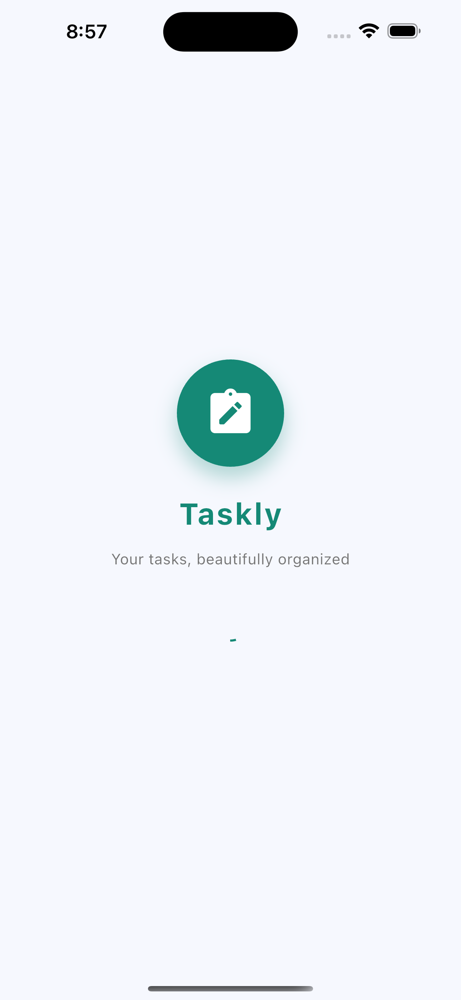
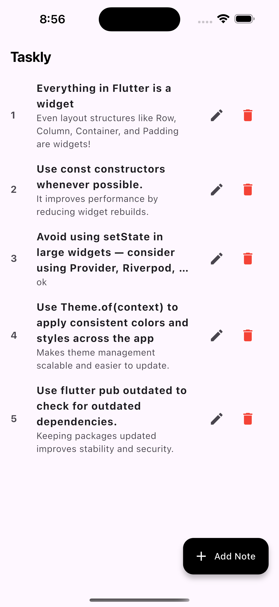
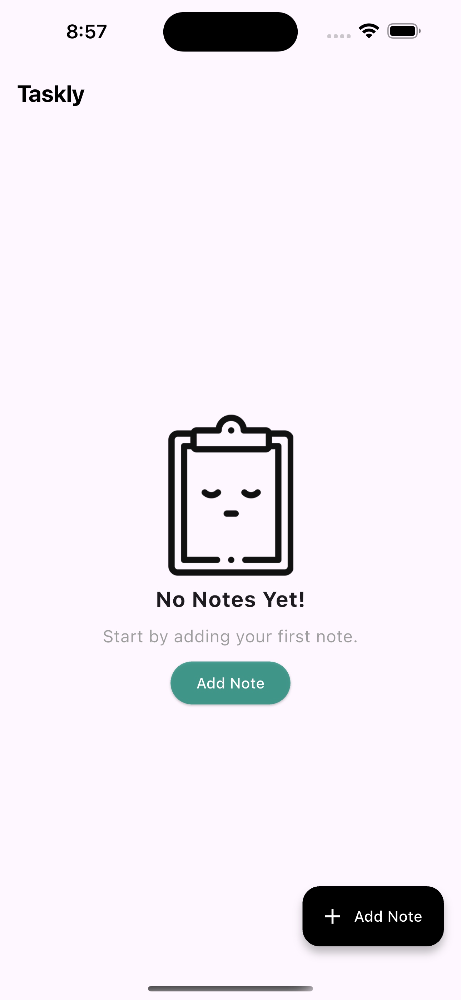
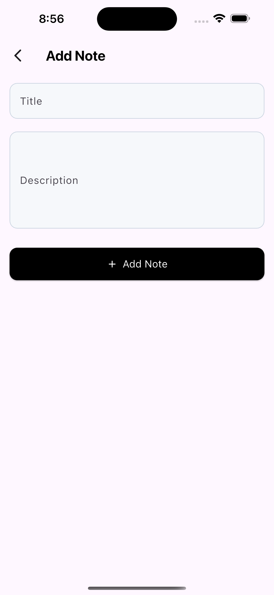
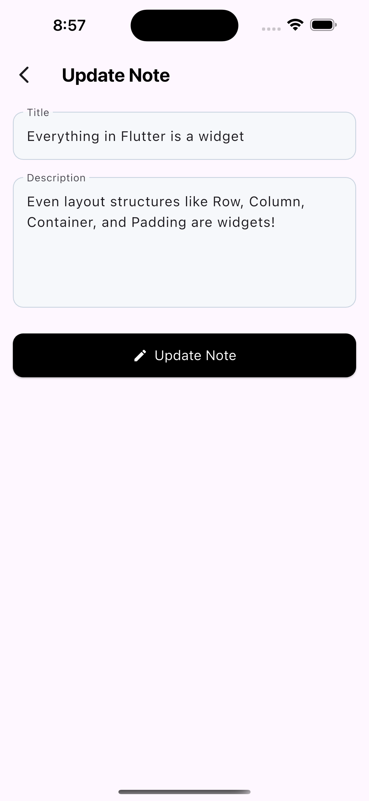

# 📝 Taskly – Your tasks, beautifully organized

Taskly is a clean and minimal Flutter note-taking app where users can add, update, and delete tasks seamlessly. Built using Provider for state management with a modern UI.

## 🚀 Features

- ✍️ Create & save notes
- 📝 Edit existing notes
- 🗑️ Delete notes with a single tap
- 💾 Local storage (SQLite / local DB via provider)
- 🌗 Clean, responsive UI

## 🛠️ Tech Stack

- ✅ **Flutter** – Frontend framework
- ✅ **Provider** – State management
- ✅ **SQLite / Local Database** – Offline-first support
- ✅ **Dart** – Backend logic

## Apps Screenshots

<table>
  <tr>
     <td>Splash Screen</td>
     <td>Home Screen</td>
     <td>Empty State Screen</td>
     <td>Add Note Screen</td>
     <td>Update Note Drawer</td>
  </tr>
  <tr>
    <td></td>
    <td></td>
    <td></td>
    <td></td>
    <td></td>
  </tr>
 </table>